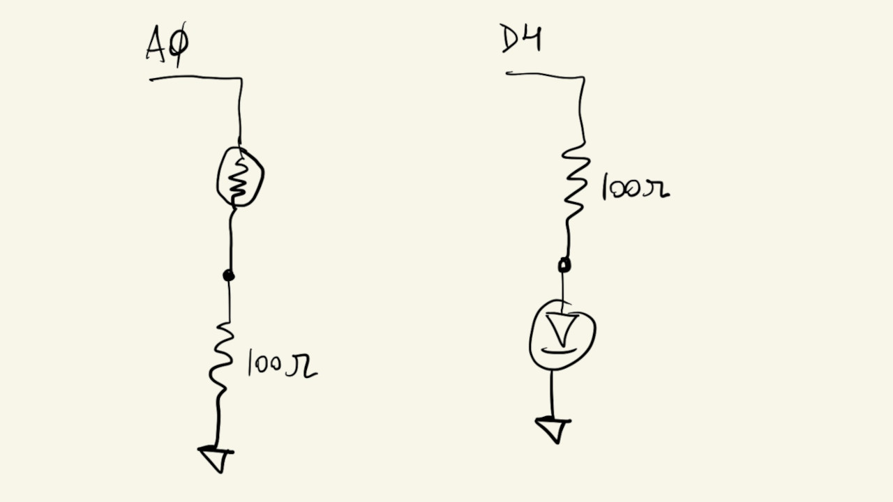
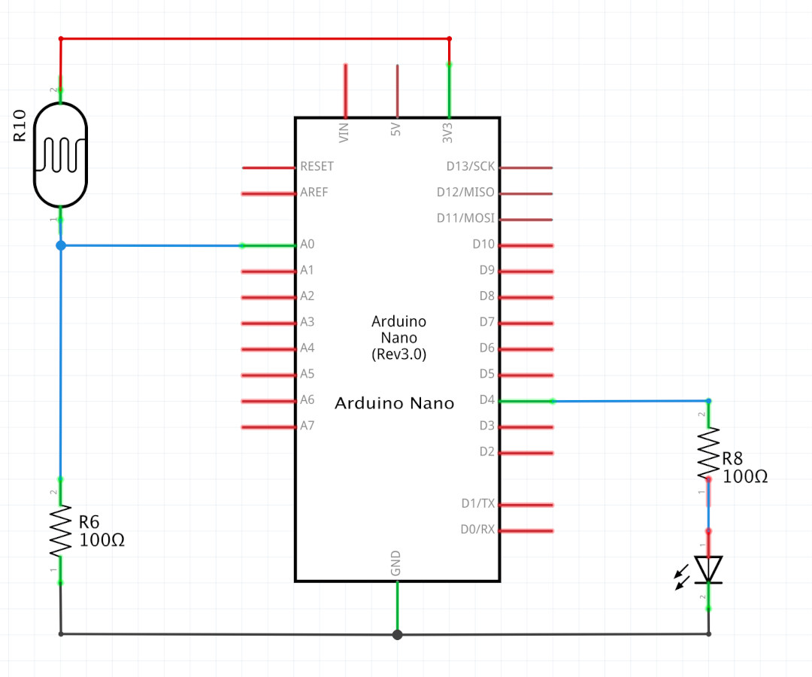
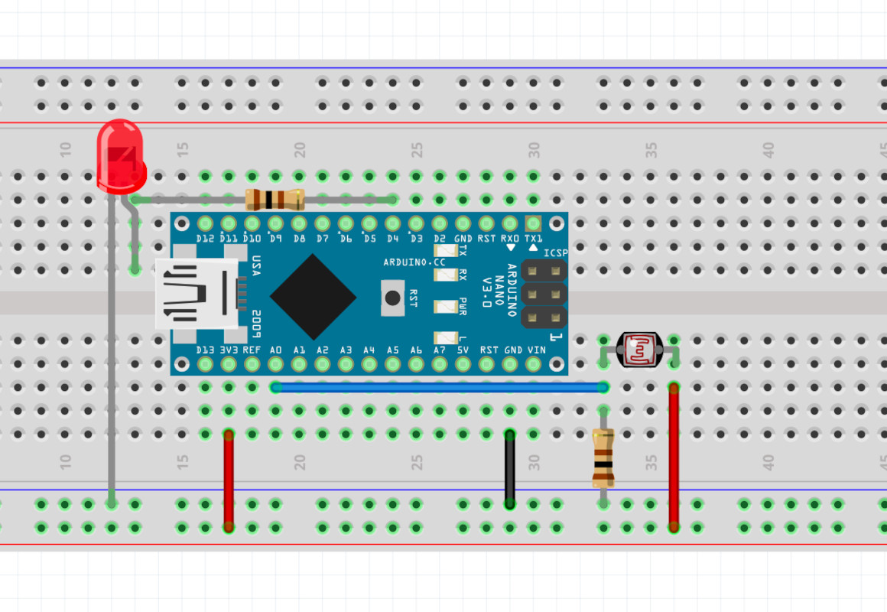
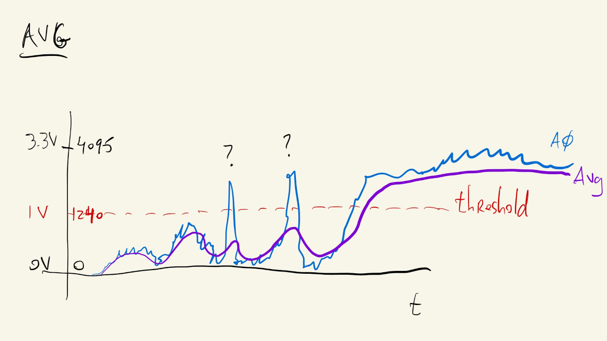
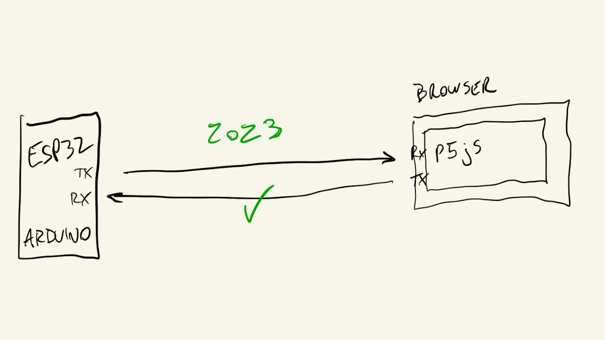
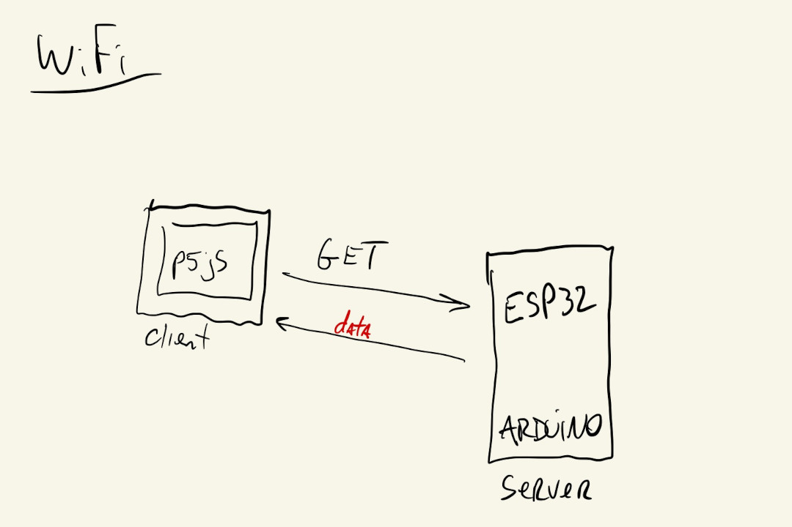
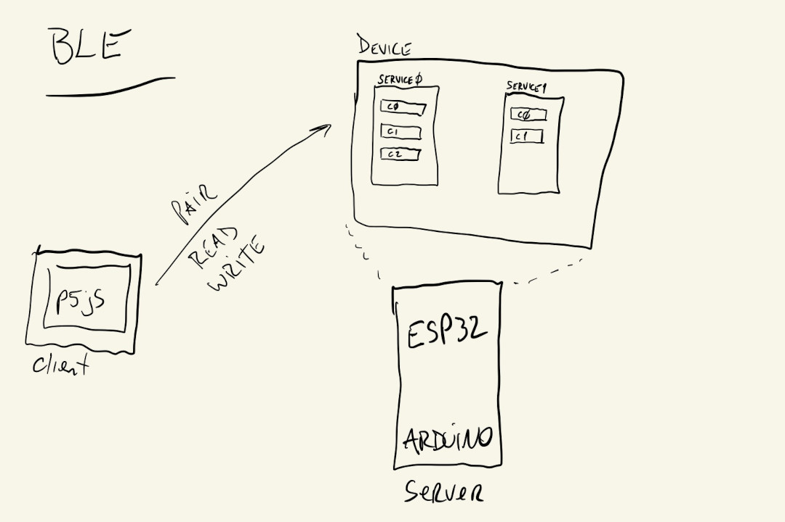

# Week 12

Repository for week 12 examples.

## Drawing


## Schematic


## Board


## Average
Implementation of a low-pass filter by averaging current and previous values of an analog input.



## Serial
Open a serial connection between the browser and the Arduino using the [p5.webserial](https://github.com/gohai/p5.webserial) library.



## WiFi
The Arduino starts a simple HTTP server that the p5js sketch can make [GET](https://developer.mozilla.org/en-US/docs/Web/HTTP/Methods/GET) requests to.



## BLE
The Arduino initializes a BLE server, with a single service and single characteristic for ```data```.

After pairing, the p5js sketch can read from the ```data``` characteristic using the [p5.ble](https://github.com/ITPNYU/p5.ble.js) library.


